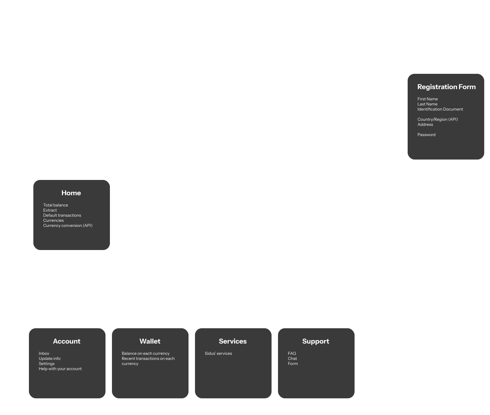
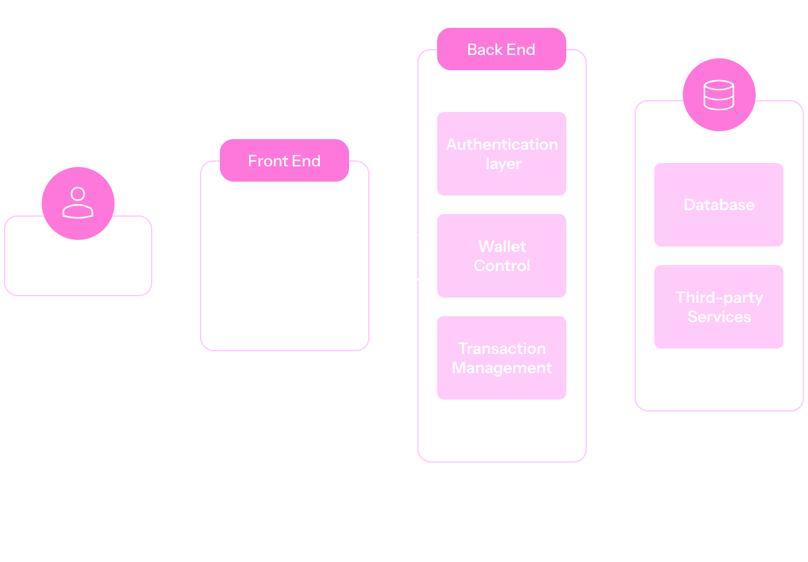

## About the project

The Sidus project is composed of two applications: a web app designed to emulate a native mobile app and a server-side data processing software connected to the database.  
The concept is: *a simple, straight-forward, modern global money transfer app*.

The project was created as a union of **three** different goals:
- Practice my software architecture skills;
- An early semester warmup;
- A design challenge.

## System architecture 

    

## Application flow

    

> [!NOTE] Current status
> Sidus is a work in progress project, currently, featuring only the web emulation of the app's frontend.

  

    
    
Enter App

